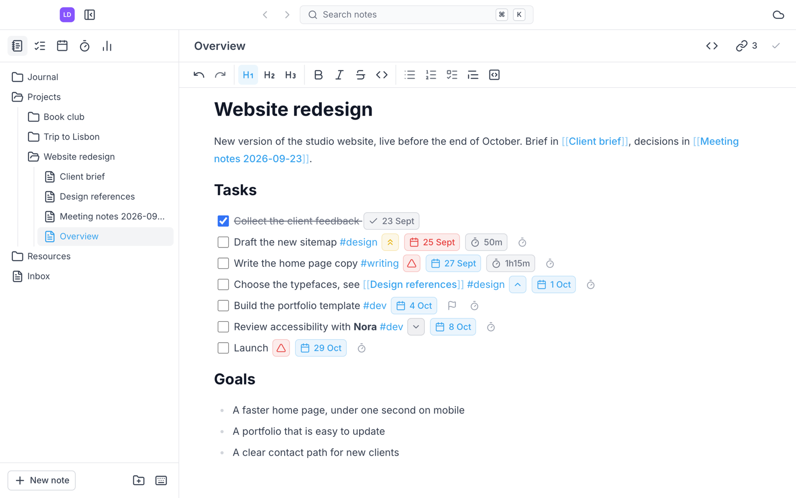
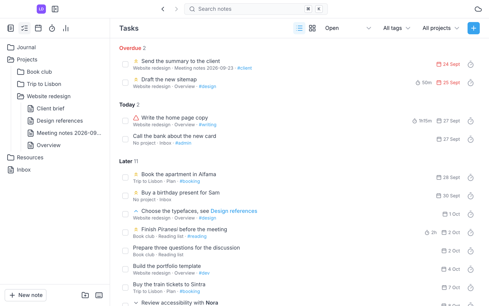
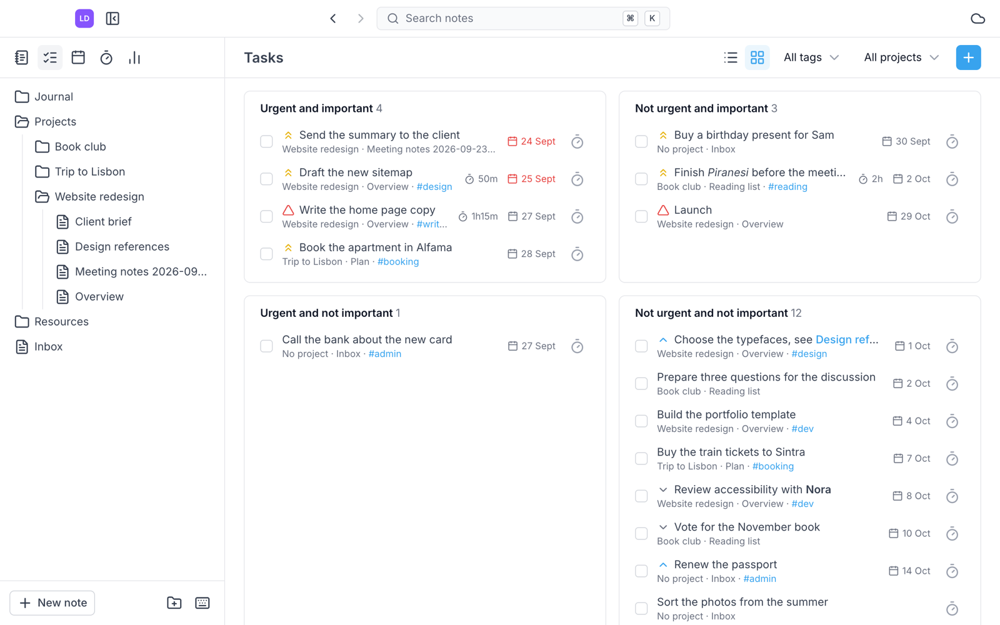
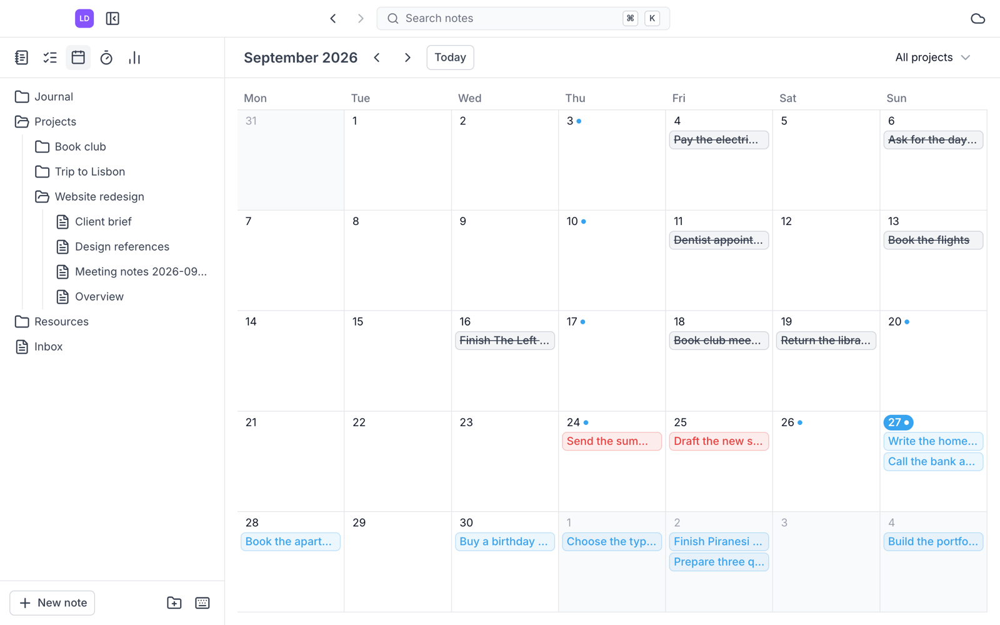
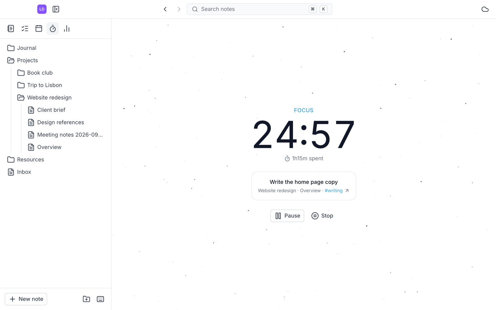
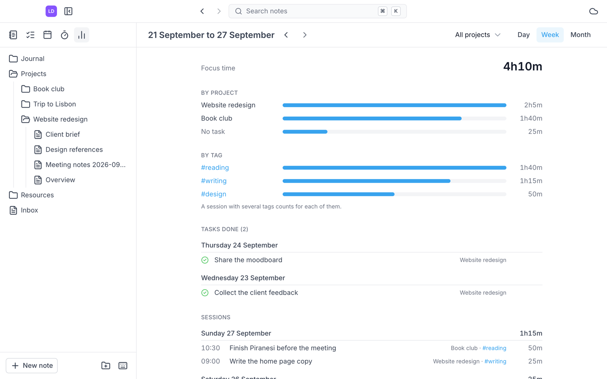
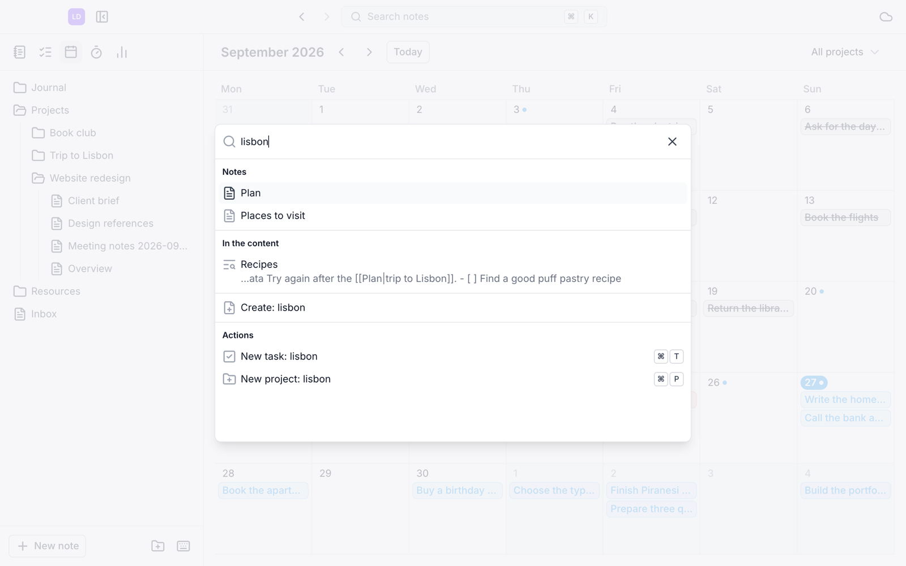

<p align="center"></p>

# Luma

Luma is a desktop app for notes, tasks and calendar, stored as plain Markdown files in a
folder of your choice, with optional sync to a GitHub repository.

This repository only hosts the downloads. The source code is not public.

<picture>
  <source media="(prefers-color-scheme: dark)" srcset="screenshots/notes-dark.png" />
  
</picture>

## Download

Get the latest version from the [Releases](https://github.com/martinloic/luma-releases/releases/latest) page.

- macOS on Apple Silicon (M1 and later): `Luma-<version>-arm64.dmg`
- Intel Macs, Windows and Linux are not supported yet.

## Features

### Notes in plain Markdown

Your notes are Markdown files in a folder you choose (a vault), browsed as a tree. The
editor saves as you type and supports task lists, tables and `[[links]]` between notes,
with backlinks. A handle next to each line moves it elsewhere in the note. A button (or
`⌘⇧M`) switches a note to its Markdown source, saved exactly as typed. The files stay
readable in any other editor, and an existing Obsidian vault can be opened as is.

### Projects and tasks

A project is a folder, and a task is a Markdown checkbox line in any note, with an optional
priority and due date ([Obsidian Tasks](https://publish.obsidian.md/tasks/) format). The
task view gathers the tasks of the whole vault: overdue, today, later and undated. Tasks
can carry `#tags`, shown in color and used to filter the view.

<picture>
  <source media="(prefers-color-scheme: dark)" srcset="screenshots/tasks-dark.png" />
  
</picture>

The same tasks can be sorted in an Eisenhower matrix, by importance (priority) and
urgency (due date).

<picture>
  <source media="(prefers-color-scheme: dark)" srcset="screenshots/matrix-dark.png" />
  
</picture>

### Calendar and daily notes

A month view shows the tasks on their due date. A click on a day opens its daily note,
or creates it.

<picture>
  <source media="(prefers-color-scheme: dark)" srcset="screenshots/calendar-dark.png" />
  
</picture>

### Focus

A Pomodoro timer of 15, 25 or 50 minutes, on a task or on nothing in particular. The time
spent is added to the task line itself (`⏱ 1h15m`).

<picture>
  <source media="(prefers-color-scheme: dark)" srcset="screenshots/focus-dark.png" />
  
</picture>

### Focus history

Every focus session is kept in the vault. The History view shows, for a day, a week or a
month, the focus time per project and per tag, the tasks done and the sessions of each day. A click on
a session or a task opens its note at the task.

<picture>
  <source media="(prefers-color-scheme: dark)" srcset="screenshots/history-dark.png" />
  
</picture>

### Search and shortcuts

`⌘K` searches the names and the contents of the notes, and runs actions such as a new
task or a new project. Keyboard shortcuts cover the frequent actions.

<picture>
  <source media="(prefers-color-scheme: dark)" srcset="screenshots/search-dark.png" />
  
</picture>

### GitHub sync

The vault can be synchronized both ways with a GitHub repository, through the Git of your
Mac. Each sync commit lists the files it changed. Conflicts never lose anything: both
versions are kept. It requires Git and a GitHub authentication already set up on your Mac
(SSH key or `gh auth login`).

### Several vaults

Luma remembers the vaults of your Mac: switch between them from the vault menu, mark
favorites, and search them when you have many.

### Light and dark, English and French

The interface follows the light or dark theme of your Mac (or the one you choose), with an
accent color of your choice, in English or French.

## Limitations

Luma is young, and some things are not there (yet):

- **One vault open at a time**: switching vaults is quick, but two vaults cannot be open
  side by side, and only the open vault is synchronized.
- **Calendar**: month view only, no week or day view. No events with times, no Google,
  Outlook or iCloud calendars, no drag and drop of tasks between days.
- **Tasks**: no recurring tasks, no start or scheduled dates, no Kanban view. Tags filter
  the task view only, not the calendar, and there is no list of the tags of the vault.
- **Focus**: 15, 25 or 50 minutes only, no long breaks, a single end chime. Sessions
  cannot be edited or entered by hand, and the history has no charts or export. The time
  spent before version 0.2.0 is not in the history.
- **Links**: embedded notes (`![[note]]`) and block links are kept in the file but not
  displayed. Standard Markdown links to notes are not followed. No graph view.
- **Renaming outside Luma**: renaming or moving notes in Finder or through Git does not
  update the `[[links]]` pointing to them. Rename and move notes in Luma.
- **GitHub sync**: Git must be installed on your Mac, and only GitHub repositories can be
  cloned. No version history or restore from Luma (Git keeps it). No sync on quit.
- **Languages**: English and French only.

## First launch on macOS

Open the DMG and drag Luma into your Applications folder.

> [!IMPORTANT]
> Luma is not signed with an Apple Developer certificate yet, so macOS says it cannot verify
> the app on its first launch. This is expected: allow it once, with one of the methods
> below. The next launches open normally.

### Recommended: Terminal

The quickest way, one command:

```bash
xattr -dr com.apple.quarantine /Applications/Luma.app
```

Then open Luma normally.

### Or: System Settings

1. Open Luma: macOS says it cannot verify the app. Close the message.
2. Open System Settings > Privacy & Security, scroll down, and click **Open Anyway** next
   to the message about Luma.
3. Confirm.

## License

Luma is free to use, but it is not open source. See [LICENSE](LICENSE).
